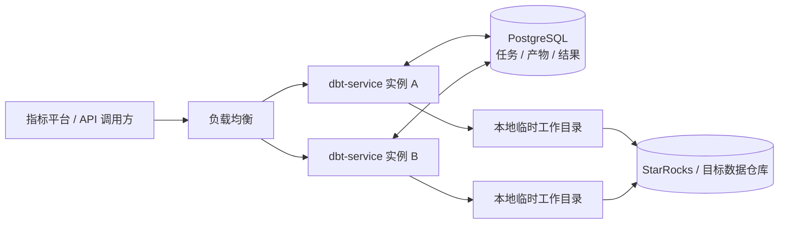

# dbt-service 基于 PostgreSQL 的无状态服务设计

日期：2026-09-30。状态：供评审的设计，尚未实施。

## 1. 目标与已确认边界

用户要求使用 PostgreSQL 作为存储数据库，将当前 dbt-service 改为可运行多个副本的无状态服务。本方案让 PostgreSQL 保存任务、项目版本、构建产物和查询结果；执行节点的磁盘仅保存可重建的工作目录。数据库可以与指标平台共用 PostgreSQL 集群，但使用独立数据库 `dbt_service` 和独立账号，指标平台继续通过 HTTP 调用服务。

用户已确认：请求携带的临时 YAML `resources` 继续只驻内存。此类任务的状态和允许返回的结果持久化；输入丢失后任务失败，调用方重新提交。它不具备跨节点恢复原始输入的能力，不能宣称所有任务都会自动重放。

无状态的验收标准：

- 普通任务可由实例 A 受理、B 执行、C 返回状态与结果，无需会话粘滞。
- 已发布 run 的本地目录全部丢失后，新实例仍能加载其语义定义和执行查询。
- 实例启动不会修改其他健康实例的任务；节点故障只影响其持有的执行租约。
- 任务受理与发布成功都有 PostgreSQL 事务作为边界，不依赖内存字典或本地 `READY` 文件。
- 对目标数据仓库的写入不能与 PostgreSQL 元数据组成原子事务。构建失联后的未知写入结果必须明确保留，不能以“无状态”为由盲目重放。

第一版覆盖 `/v1/dbt/jobs`、`/v1/metricflow/jobs`、`/v1/jobs/{id}`、固定版本 run、catalog、query-options、query-jobs 和 cleanup。保持现有 dbt/MetricFlow 版本与 SQL 渲染路径，接口继续使用现有请求字段和任务 ID。

## 2. 当前实现中的单机依赖

| 位置 | 当前行为 | 多副本下的问题 |
| --- | --- | --- |
| `platform_store.py` | SQLite 保存 run/query 索引，启动时把运行中的任务标记为中断 | 索引无法在独立磁盘间共享；照搬启动恢复会误伤别的实例 |
| `platform_runs.py` | 保存绝对路径 `project-path.json`，靠本地目录和 `READY` 文件发布 | 查询换节点后找不到项目与产物 |
| `platform_queries.py` | `asyncio.create_task` 调度，结果写入本地 `result.json` | 受理后节点退出可能丢任务；其他实例读不到结果 |
| `jobs.py` | `_jobs`、`_busy_projects` 和任务调度均在进程内 | 重启丢历史；跨节点项目写入互斥失效 |
| `projects.py` | 将项目名解析为 `projects/` 中的本地目录 | 各节点可能看到不同项目版本 |
| `platform_metricflow.py` | 从固定项目目录加载配置与 `target/semantic_manifest.json` | 仅保存一个 semantic manifest 文件不足以直接替代现有运行方式 |

本地抽样的一份现有 run 目录约 4.1 MB、90 个文件，仅作为当前规模参考，不代表压测结果。需要持久化原生产物的原始字节，继续保持现有 digest 校验。

## 3. 方案选择与部署结构

| 方案 | 取舍 |
| --- | --- |
| **PostgreSQL 保存状态、文件和队列（选择）** | 满足当前指定的存储方案；发布状态和产物引用可同事务提交。大文件和大量结果会增加 WAL、备份与复制成本，因此必须限制大小 |
| PostgreSQL 状态 + 共享文件系统 | 保留目录访问较容易，但仍需额外共享卷、文件发布协议和运维能力 |
| PostgreSQL 状态 + 对象存储 | 适合更大的产物规模，但引入另一套存储及跨存储提交流程；当前不引入 |



第一版每个副本同时运行 HTTP API 和有并发上限的 worker 循环，使用同一个镜像。API 负责持久化受理和读取；worker 从 PostgreSQL 认领任务。`asyncio` 可以继续管理本机子进程，但不再作为任务是否存在的依据。队列通过数据库轮询实现，无需新增 Redis 或消息队列。

PostgreSQL 保存的是服务控制状态与产物，模型表、视图和业务数据继续位于目标数据仓库。PostgreSQL 自身需要持久存储和备份，服务无状态不等于整个系统没有状态。

## 4. 数据模型：六张业务表

另有一张迁移工具维护的 schema 版本表。以下字段为逻辑设计，实施迁移时必须逐列编写 `COMMENT ON COLUMN`，补齐外键与枚举检查。所有业务时间使用 `timestamptz`，租约时间以数据库时钟为准。

### 4.1 `runtime_project`：项目注册与通用写任务互斥

| 字段 | 含义 |
| --- | --- |
| `project_id text PK` | HTTP 请求中的逻辑项目标识 |
| `binding_config jsonb` | 受控 Git remote、子目录、profile 引用等非敏感配置，不接受请求覆盖 |
| `config_version text` | 连接和项目配置的版本标识 |
| `source_set_id uuid FK` | 已导入的当前项目源码快照；供通用 CLI 接口使用 |
| `current_output_set_id uuid FK` | 同一源码版本最近一次成功的默认解析/构建产物 |
| `busy_job_id uuid FK` | 当前通用写任务；存在未确认停止的写任务时不能释放 |
| `revision bigint` | 项目指针更新的乐观并发版本 |

当前 `projects/` 中的项目通过管理导入工具存入 PostgreSQL。导入工具读取本地目录或受控 Git 固定 SHA，HTTP 查询端不再依赖这个目录。源码更新后，旧 `current_output_set_id` 不能作为新源码的产物使用。

### 4.2 `runtime_job`：受理记录、持久队列和公开状态

| 字段 | 含义 |
| --- | --- |
| `job_id uuid PK` | 现有 runId/queryId/job id；迁移时保留原 ID |
| `kind text` | `BUILD_RUN`、`METRIC_QUERY`、`DBT_COMMAND`、`MF_COMMAND`、`QUERY_OPTIONS` 或 `RUN_CLEANUP` |
| `project_id text FK`、`parent_run_id uuid FK` | 所属项目，以及查询/清理所绑定的固定 run |
| `idempotency_scope text`、`idempotency_key text` | 平台 run/query 各自保留原幂等命名空间；普通无幂等键接口可为空 |
| `request_fingerprint text`、`request_json jsonb` | 规范化请求摘要和可重放参数；排除 credentials、完整子进程环境与 resources 原文 |
| `input_mode text`、`pinned_instance_id uuid` | `DURABLE` 或 `VOLATILE`；后者仅允许持有内存输入的实例执行 |
| `input_lease_expires_at timestamptz` | VOLATILE 输入持有者的租约；受理时设置，覆盖尚未领取执行的等待期，DURABLE 为空 |
| `input_set_id uuid FK`、`output_set_id uuid FK` | 受理时固定的输入快照，以及成功发布的输出产物集 |
| `config_version text`、`toolchain_version text` | 所需配置版本与镜像/依赖锁定标识 |
| `schema_name text`、`profile_binding_id text` | BUILD_RUN 使用的物理 schema 与连接配置引用，不保存连接凭据 |
| `status text`、`phase text` | 内部生命周期，以及构建的 PREPARING/BUILDING/VALIDATING 阶段 |
| `run_lifecycle text` | BUILD_RUN 的 ACTIVE/CLEANING/CLEANED 生命周期，独立于构建执行状态 |
| `attempt_no int`、`current_attempt_id uuid FK` | 已执行次数与唯一当前 attempt |
| `available_at timestamptz`、`deadline_at timestamptz` | 下次可执行时间和任务总截止时间；重试不无限延长超时 |
| `max_attempts int`、`retry_policy text` | 受控重试次数与安全类别 |
| `error_code text`、`error_detail jsonb` | 稳定诊断码及脱敏、受长度限制的说明 |
| `created_at/started_at/finished_at timestamptz` | 受理、首次执行和最终结束时间 |

约束：幂等键非空时唯一键为 `(idempotency_scope, idempotency_key)`；同键不同请求摘要返回冲突。parent 必须是 BUILD_RUN；输出产物必须属于同一任务的获准 attempt。内部状态映射维持当前接口：通用任务使用小写状态；平台查询成功为 `READY`；构建运行期间按 phase 输出原状态，成功 ACTIVE 为 `READY`，清理期间为 `CLEANING`，完成为 `CLEANED`。平台任务超时映射为现有 `FAILED`，通过 errorCode 区分超时原因，不增加公开的 TIMED_OUT 状态。

队列索引以 `(kind, available_at, created_at)` 为基础，对 `status = QUEUED` 建部分索引；另建 parent run 活动任务索引。规范化摘要包含实际固定的源码版本及配置版本，不能只对未解析的项目名计算。

### 4.3 `runtime_attempt`：执行租约与失联记录

| 字段 | 含义 |
| --- | --- |
| `attempt_id uuid PK`、`job_id uuid FK`、`attempt_no int` | 某任务的一次实际执行，`(job_id, attempt_no)` 唯一 |
| `worker_id uuid`、`lease_token uuid UNIQUE` | 进程启动时生成的实例标识，以及该次执行的唯一写入凭证 |
| `lease_expires_at/heartbeat_at timestamptz` | 租约截止时间及最近心跳 |
| `execution_stage text` | 明确区分尚未调用外部引擎与已经启动外部执行 |
| `state text` | EXECUTING、SUCCEEDED、FAILED、EXPIRED_UNCONFIRMED、STOPPED |
| `external_execution_refs jsonb` | 可取得的目标库会话/查询标识，不含连接信息；用于取消与核对 |
| `stop_confirmed_at timestamptz` | 已确认子进程和其外部执行终止的时间；为空不能推断已停止 |
| `started_at/finished_at timestamptz` | attempt 的执行时间 |

必须单独保存 attempt：查询重试成功后，旧失联实例仍可能持有旧 SQL；仅保留任务的最新状态会让清理流程误判“没有执行者”。失效 attempt 可以上报自身停止情况，但不能再修改任务结果。

### 4.4 `runtime_artifact_set`：一个不可变源码或产物版本

| 字段 | 含义 |
| --- | --- |
| `set_id uuid PK`、`project_id text FK` | 产物集身份及所属项目 |
| `producer_attempt_id uuid FK NULL` | 创建该集合的 attempt；管理导入的源码集合为空 |
| `kind text`、`state text` | SOURCE/EXECUTION；STAGING/SEALED/DELETING |
| `source_commit_sha text`、`project_digest text` | 固定 Git 来源和原有项目摘要 |
| `source_set_id uuid FK NULL` | 执行产物对应的源码集合 |
| `config_version/toolchain_version/format_version text` | 还原和解析产物所需版本 |
| `content_digest text`、`file_count int`、`raw_bytes bigint` | 按相对路径排序的文件摘要清单之摘要、文件数和原始总大小 |
| `validation_json jsonb`、`catalog_json jsonb` | 原有验证结果与由原生产物派生的目录，供任意 API 实例直接读取 |
| `created_at/sealed_at timestamptz` | 创建及封存时间 |

SEALED 集合的文件不可覆盖。更新项目或重新构建必须产生新集合。STAGING 集合不能供查询读取。产物摘要不包含任何本地绝对路径。

### 4.5 `runtime_artifact_file`：文件原始内容

| 字段 | 含义 |
| --- | --- |
| `set_id uuid FK`、`relative_path text` | 复合主键；路径为规范化 POSIX 相对路径 |
| `content bytea`、`codec text` | 原始文件或 gzip 压缩后的字节；编码枚举为 raw/gzip |
| `raw_sha256 text`、`raw_size bigint`、`stored_size bigint` | 原始字节摘要及压缩前后大小 |
| `media_type text`、`executable boolean` | 文件内容类型与必要的执行位 |

`manifest.json` 和 `semantic_manifest.json` 保留原始字节，避免 JSONB 重新序列化改变既有 digest。JSONB 用于结构化请求、目录和查询结果，不替代原始文件。`bytea` 与 TOAST 是 PostgreSQL 原生能力；本方案按文件设限，不使用大对象 OID 或自建分片表。

产物入库使用只追加写入。数据库触发器禁止修改 SEALED 集合的文件，插入文件必须锁定所属 STAGING 集合；清理先在事务中将集合标为 DELETING，再删除文件，避免发布与删除交错。

### 4.6 `runtime_job_result`：结果与有界诊断

| 字段 | 含义 |
| --- | --- |
| `job_id uuid PK/FK`、`attempt_id uuid FK` | 结果所属任务及实际获准提交的 attempt |
| `payload_json jsonb`、`format_version text` | columns、rows、SQL、truncated、duration 等已有结果结构及版本 |
| `stdout_tail text`、`stderr_tail text` | 有长度上限、已脱敏的 CLI 输出 |
| `exit_code int`、`output_truncated boolean` | 子进程退出状态及输出截断标记 |
| `created_at timestamptz` | 结果提交时间 |

继续使用现有行序列化规则，Decimal 等值按当前约定转成字符串，避免经过 JSONB 和 Python 时引入浮点精度损失。普通状态轮询只读任务元数据，需要结果时才读取大字段。

## 5. 产物边界与本地工作目录

SOURCE 集合包含 dbt 项目文件、允许的 SQL/YAML、macros、seeds、snapshots、配置的其他输入及依赖锁文件。EXECUTION 集合保存还原查询所需的项目文件、实际解析后的 `dbt_packages` 依赖，以及：

```text
target/manifest.json
target/semantic_manifest.json
target/run_results.json
target/catalog.json
```

固定版本发布仍要求四份产物完整；普通 parse/compile 任务只按实际命令保存其输出，不能误套“必须具备 catalog”的构建规则。compiled/run SQL 仅在有诊断价值且未超限时保存，不作为查询必需文件。解析依赖在构建时固化，查询节点不再执行 `dbt deps`。

不收集 `.git`、`logs/`、缓存、临时请求文件、`partial_parse.msgpack`、`profiles.yml` 和凭据。partial parse 可能含路径和运行上下文，不跨节点复用。包内链接必须在构建时验证目标位于允许输入根目录，再转换成普通文件；不持久化可逃逸的链接。

worker 使用 `<temp>/<job_id>/<attempt_id>/` 还原隔离目录，每次校验相对路径、大小和原始摘要。由同版本配置和 Secret 注入生成临时 profile，再使用现有 CLI/程序化入口。本地路径可以出现在受控的进程参数中，但不得成为 PostgreSQL 中的持久定位符。

初期每次还原到独立工作目录即可，避免共享可写缓存影响多个查询；缓存不是完成无状态改造的前提。冷启动查询只需要 PostgreSQL、匹配版本的配置/Secret 和目标仓库，不依赖 Git 可用性。

## 6. 发布与读取流程

### 固定版本构建

1. API 校验项目绑定，在事务中受理 BUILD_RUN、保存固定 SHA/摘要/配置版本、生成 `run_<runId.hex>`，事务提交后返回 202。
2. worker 认领任务后，从受控 Git 读取固定 SHA 并校验摘要，将源码保存为 SEALED SOURCE 集合。此后的安全准备阶段重试可复用这份源码。
3. 还原到临时目录，固化依赖。在启动可能写目标库的命令之前，先持久化外部执行已开始的标记。
4. 沿用现有全量 build、docs generate、真实查询探针和产物校验。失败不能发布。
5. 按文件上传到本 attempt 的 STAGING EXECUTION 集合；上传过程不持有整个构建周期的数据库事务。
6. 最终事务锁定任务、attempt 和产物集，核对有效租约、当前 token、必需文件、完整清单和验证证据；封存集合并同时设置任务成功和 `output_set_id`。
7. 任意实例的 run/catalog GET 都从 PostgreSQL 读取该已提交版本。API 节点不再读取本地 `READY` 文件。

进程在步骤 5 退出时只留下不可见的 STAGING 文件；步骤 6 的提交即为成功的持久边界。提交结果因网络断开未知时，先按 jobId/幂等键查询数据库，不能立刻新建或重复执行任务。

### 固定版本查询与结果

1. 在事务中锁定 parent run，确认 READY/ACTIVE 和 SEALED 产物；绑定 `input_set_id` 并插入查询任务后返回 202。
2. 任意匹配版本 worker 下载该固定集合，还原临时目录，加载 semantic manifest 并执行已有查询路径。
3. 在同一事务中验证租约 token、保存结果并将查询标记 READY。过期 attempt 的结果被拒绝。
4. 任意 API 实例从 PostgreSQL 读取结果，不向原执行实例转发请求。刷新 GET 不重新执行 SQL。

`query-options` 仍是同步响应，内部创建受 run 引用保护的 QUERY_OPTIONS 任务并等待结果；等待超过服务时间预算返回可重试的 503。任务独立完成后可按固定 run+产物摘要+参数复用成功结果，不能把旧版本选项用于新 run。无效请求仍按现有 422 语义处理。

### 通用 CLI 项目

普通任务受理时固定项目 SOURCE/EXECUTION 集合及 target 配置；新的项目导入不影响已受理任务。无 resources 的成功 parse/build 将产物封存，并在项目源码版本仍匹配时更新当前产物指针。无有效 manifest 的 MetricFlow 请求仍按现有前置校验拒绝。

通用写任务按逻辑 `project_id` 在 PostgreSQL 中互斥，替代本地目录锁。受理事务锁定项目行，发现 busy_job_id 即返回现有 `409 project_busy`。锁归属在任务入队时就落库；只有确认外部执行结束后才能释放。

### 临时 resources 任务

- 接收实例持有经过校验的原始输入，并保留本机有界执行槽位；仅将排除了 resources 的任务记录写入数据库，设置 VOLATILE 和接收实例 ID，事务提交后返回 202。
- 受理事务同时设置输入租约，接收实例从等待阶段开始续租，直到任务结束。恢复扫描覆盖 QUEUED 和 RUNNING；即使节点在返回 202 后、创建第一个 attempt 前退出，输入租约过期也会触发 INPUT_LOST。领取与结果发布必须同时校验输入租约和执行租约，已过期的输入租约不能复活。
- 该任务由接收实例的 worker 执行，stdin 传递继续沿用现有机制；其他实例可以查询其持久状态和允许返回的结果。
- 原始 YAML 不进入 PostgreSQL、磁盘请求文件、argv、环境变量或持久化调度消息；不把包含原文的请求对象序列化到日志。
- 该任务的派生项目产物仍是任务临时文件，不能更新通用项目的默认产物，也不作为可恢复发布版本保存。
- 实例失联后标记 `FAILED/INPUT_LOST`，不跨节点重放。若已经发生外部写入，另记外部结果未知并保留写入保护，不能因为输入丢失就释放它。
- 过载且无法持有内存输入时，在受理之前返回 503；允许调用方重新提交，不先返回成功再丢输入。

## 7. PostgreSQL 队列、租约与失败恢复

采用 READ COMMITTED 下的短事务和 `SELECT ... FOR UPDATE SKIP LOCKED`。认领事务先选取到期 QUEUED 任务，再创建 attempt、增加 attempt_no 并设置 current_attempt_id。领取条件还必须匹配 worker 支持的工具链/配置；VOLATILE 任务只匹配仍持有有效输入租约的接收实例。

以下只表达锁定方式，实际查询须加上上述能力与输入归属条件：

```sql
-- 仅锁定本轮认领的任务行，跳过其他消费者已经锁住的任务。
SELECT job_id
FROM runtime_job
WHERE status = 'QUEUED'
  AND available_at <= clock_timestamp()
ORDER BY available_at, created_at
LIMIT :capacity
FOR UPDATE SKIP LOCKED;
```

认领后立即提交，执行 dbt 的数分钟内不持有行锁或长事务。第一版只轮询持久队列；如未来加入 NOTIFY，它也只能用于唤醒，不能替代任务记录。

建议起始配置：租约 90 秒、心跳 15 秒；本机连续 45 秒未确认续租即停止接收工作并尝试终止子进程树。心跳、状态更新和结果发布均检查 current_attempt_id、token、状态以及租约尚未过期；已过期的执行者不能通过迟到心跳恢复权限。重试和超时判断使用数据库时钟，进程内停止预算使用单调时钟。

恢复进程只处理已过期的执行租约或 VOLATILE 输入租约，不能在服务启动时批量清空 RUNNING 状态。输入租约采用相同的 90 秒有效期和 15 秒心跳规则。行锁串行化恢复决策，失效 token 后才允许新 attempt。

| 故障位置/任务 | 默认处理 |
| --- | --- |
| QUEUED 持久任务，API 实例退出 | 其他 worker 正常认领 |
| 持久任务尚未开始外部执行 | 安全准备阶段可重试，总共最多 3 次 |
| 经绑定确认只读的指标 QUERY/PREVIEW/OPTIONS/EXPLAIN | 可重试，总共最多 3 次；旧 attempt 保留失联记录 |
| 已开始执行的 dbt CLI 或 BUILD_RUN | 不自动重放；FAILED + `EXECUTION_OUTCOME_UNKNOWN`，核对目标库后再由调用方发起新任务 |
| VOLATILE 输入丢失 | FAILED + `INPUT_LOST`，由调用方重传 |
| 产物上传中断 | 部分集合不可见；终止任务后由 GC 回收 |
| 结果事务提交成功后 worker 退出 | 任何实例直接读取已提交结果 |
| PostgreSQL 暂时不可用 | 新任务受理返回 503；worker 不执行没有成功认领的任务，正在运行的任务按续租失败规则停止 |

重试采用 5 秒、15 秒退避；SQL 语法错误、语义定义错误和权限错误直接失败。查询重试只保证返回某次成功执行的结果，目标数据可能已变化；固定的是定义和发布版本，不是数据库事务快照。

只读重试资格由受控连接绑定声明，并由目标库只读账号权限保障，不能仅凭 SQL 以 SELECT 开头判断。未确认只读的执行在失联后按外部结果未知处理，不自动重放。

租约 token 只能阻止旧 worker 提交服务状态，无法撤销已经发往 StarRocks 的 SQL。无法确认终止的 attempt 保持 EXPIRED_UNCONFIRMED；必要时通过目标库会话标识取消、确认实例终止或运维核对后解除保护。尤其不能宣称 PostgreSQL 事务提供目标仓库写入的 exactly-once 保证。

## 8. 清理与引用保护

查询受理和 run 清理遵循同一个锁顺序：先锁 parent BUILD_RUN 行，再访问子任务/attempt/产物。清理检查 QUEUED/RUNNING 子任务、查询选项任务，以及任何未确认停止的外部 attempt。存在其中任一项即返回现有 `409 run_cleanup_blocked`。

满足条件后，在事务中把 parent 标为 CLEANING 并创建唯一 RUN_CLEANUP 任务。之后新查询被拒绝。worker 根据持久 schema、配置引用和产物执行 schema 删除，确认目标不存在后，才将 parent 标为 CLEANED。清理使用固定且永不复用的 run schema，已不存在视作成功；错误和未知状态不能假报 CLEANED。

保留 cleanup 端点的同步成功语义：请求等待持久清理任务完成，只有完成才返回 200/CLEANED；超过等待预算或发生瞬时故障返回 503，调用方重试连接到同一个清理任务。不得在刚入队时返回 CLEANED。清理失败期间保持阻止新查询，重复调用可恢复幂等清理。

第一版保留活动 run 的全部产物及其查询结果，直到平台明确发起 run 清理。清理完成后可删除无其他引用的产物和结果，保留任务/幂等键/清理状态记录。通用任务的最终状态与有界结果默认保留，旧源码/输出集合只有在不被项目指针、任务或未结束 attempt 引用时才可回收。自动缩短结果保留期需要额外定义过期响应契约，不在本轮静默改变 GET 行为。

STAGING 集合满 24 小时且生产 attempt 已终止、无有效任务引用时可回收。GC 的引用检查与删除认领也使用数据库事务；本地临时目录只清理由该实例创建且已确认进程结束的目录。

## 9. 容量、配置与运维

初始可配置上限：单文件原始大小 64 MiB，单产物集原始总量 256 MiB，单查询结果序列化后 16 MiB，stdout/stderr 各 1 MiB，每实例同时执行任务数 2。它们是设计起点，实施时通过实际产物压测调整；超过限制明确失败，不能悄悄丢文件后发布 READY。上传前及解压还原时均校验大小。

状态表与大内容表分开，心跳不修改产物行。文件写入后不反复覆盖。第一版不建全库 JSON GIN 索引、不实现内容去重或手工分片。部署必须设置可用存储告警和入队容量门禁，容量耗尽返回可诊断错误；发布版本不能按磁盘压力自动淘汰。观察队列等待时间、执行时长、租约过期数、未知外部执行数、产物体积、结果体积、WAL 和备份体积。

连接配置建议：

- `SERVICE_DATABASE_URL`：通过 Secret 注入的服务 PostgreSQL DSN，不进入日志或任务请求。
- `SERVICE_TEMP_ROOT`：本地临时目录，替代持久定位用途的 JOB_ARTIFACTS_ROOT。
- `WORKER_CONCURRENCY`、`JOB_LEASE_SECONDS`、`JOB_HEARTBEAT_SECONDS`：有界执行与租约参数。
- 文件、集合和结果大小限制：由配置统一提供，健康检查可报告限额是否有效。
- profile 凭据来自部署 Secret；数据库只保存 profileBindingId/configVersion。所有能执行该版本的 worker 必须取得同版本绑定与必要 Secret。

工具链版本包含 dbt、MetricFlow、adapter、服务产物格式及镜像/锁文件标识。滚动升级中，worker 只认领自身支持的任务；不兼容版本的已发布 run 在验证迁移前保留对应执行镜像。凭据轮换可复用稳定的 Secret 引用，改变目标库含义必须产生新配置版本。

数据库 schema 迁移由部署阶段单独执行，应用启动只验证版本，不由多个副本竞争执行 DDL。`/health/live` 检查进程；`/health/ready` 检查 PostgreSQL 连通性、迁移版本、工具链、配置绑定和临时目录。连接或版本不就绪时返回 503。

现有依赖树已有 `psycopg2-binary 2.9.13`，实施时将实际使用的驱动声明为直接依赖并继续固定版本。同步 SQL 在有界线程执行器中运行，连接每次只归一个线程使用；使用短事务与连接池，不阻塞 FastAPI 事件循环，不为此次设计新增 ORM。

PostgreSQL 的备份需要覆盖内容表，并验证恢复后可还原产物。恢复服务数据库不会恢复目标仓库的模型数据；灾备验证同时检查持久 schema 是否还存在，不能把历史 READY 记录当作目标库仍可查询的证明。

## 10. 代码落点与接口兼容

| 位置 | 改造职责 |
| --- | --- |
| `storage/postgres.py` 与 SQL migrations | 连接池、事务和服务独立 schema |
| `storage/jobs.py` | 任务受理、幂等、attempt/租约、结果提交、清理门禁 |
| `storage/artifacts.py` | 相对路径文件集、bytea 读写、封存、校验与 GC |
| `storage/projects.py` | 项目注册、输入版本与通用写锁 |
| `worker.py` | 持久队列认领、心跳、超时、恢复策略及子进程生命周期 |
| `workspace.py` | 从 PostgreSQL 还原隔离目录、生成临时 profile、回收临时文件 |
| 现有 `platform_runs.py` / `platform_queries.py` | 保留业务编排与验证，改为使用持久任务和产物集合 |
| 现有 `platform_store.py` | 运行时 SQLite 实现退出；旧格式仅由迁移工具读取 |
| 现有 `jobs.py` / `projects.py` | 保留 CLI 执行与项目校验能力，移走内存历史和本地目录唯一来源 |
| 现有 `resource_worker.py` 等 | 保持 stdin 输入和请求级 YAML 隔离 |
| 现有 `api.py` / `settings.py` | 初始化 PostgreSQL 仓储、worker 和生命周期，状态读取统一走数据库 |

项目源码导入与 SQLite/文件迁移使用管理工具，不新增允许任意文件路径或 Git remote 的公共 HTTP 接口。库表没有产品目录的第二套业务定义；指标平台仍负责 release 发布指针，服务负责 run 执行证据。

HTTP 字段、UUID 和成功状态保留。新增稳定 errorCode 通过现有错误字段返回，通用任务通过现有 stderr/状态表达受控诊断。数据库不可用、同步 OPTIONS/cleanup 等待超时使用 503；这些响应需要同时补齐服务 OpenAPI、README 和指标平台 HTTP client 契约测试，保证重试不会将异步受理误认为完成。

## 11. 迁移与实施顺序

以下是交付阶段划分，不是已批准的逐文件实施计划。

1. 建立 PostgreSQL schema、仓储和真实并发测试，完成字节级产物保存/还原。
2. 引入任务与 attempt 队列，先完成固定版本构建、查询、结果读取和 cleanup 的双实例验证。
3. 改造通用 CLI 项目注册、持久状态与项目互斥；按已确认规则接入 VOLATILE resources。
4. 完成旧记录迁移、健康检查、容量约束、故障演练与受控切换。通用接口未完成前，不对外宣称整个服务已无状态。

切换时先暂停旧实例的新任务受理，排空或明确结束所有执行。备份 SQLite、run 目录和查询结果，迁移工具以旧 UUID 幂等导入记录及文件，不重新运行 dbt；对旧 READY 记录验证全部原生产物摘要和原 schemaName 后才启用。保留已有 runId，使指标平台现有 release 引用继续有效。

旧 `project-path.json` 仅作为迁移工具的本机读取线索，迁移后改为 artifact_set 引用。缺文件的旧 READY 记录不能凭状态文字导入为 READY，应报告迁移失败并保留原数据。

旧通用任务历史只在进程内存，磁盘备份无法恢复它们；切换前能导出的历史需导出并核对，未导出/已丢失的旧 ID 不能承诺恢复。持久化保证从新系统成功受理的任务开始成立。临时 resources 原文不导出。

切换前逐项核对原 ID、摘要、目录内容与读取结果，并在新实例上执行代表性只读查询。保留旧备份用于切换前回退。新系统开始受理新任务后，不能直接回到仅含旧 SQLite 的版本；需要停受理、排空并明确迁移新增状态，避免历史分叉。实施和验证不会顺带修改 vendor 的 Git 指针。

## 12. 必须通过的验证

| 场景 | 预期 |
| --- | --- |
| A 受理，B 执行，C 读取，三个临时根目录完全不同 | 状态与结果一致 |
| 构建发布后删除全部实例本地缓存并启动新实例 | 仅凭 PG 中产物完成 QUERY、PREVIEW、OPTIONS 和 catalog |
| 多实例同幂等键并发受理，同键不同内容 | 同内容只有一个 job；不同内容返回冲突 |
| worker 认领后退出；旧 worker 迟到提交或恢复心跳 | 按策略恢复；旧 token 不能发布结果 |
| 发布前、文件上传中、最终事务提交后分别杀进程 | 不出现缺产物的 READY；已提交成功可正常读取 |
| dbt 已执行增量写入/hook 后失联 | 不自动重跑，未知结果可观察，写保护不被误释放 |
| QUERY/OPTIONS 入队和 cleanup 同时发生 | 一个获得 parent 锁后决定合法顺序，不能删除活动 run |
| 查询重试成功但旧 attempt 仍失联 | cleanup 继续被阻止，直到确认旧执行终止 |
| 项目并发导入与通用 build | 已受理任务使用固定输入，新源码不继承旧产物 |
| VOLATILE resources 接收节点在返回 202 后、领取前或执行中退出 | 输入租约过期后任意节点可读失败状态；PG、持久文件和日志没有原始 resources 请求 |
| 大文件、损坏摘要、路径穿越、解压超限 | 明确拒绝，不写出临时目录，不发布 READY |
| 原有高精度结果经 PG 保存/读取 | 行、列和数值精度与现有公开契约一致 |
| PostgreSQL 故障及恢复 | 无成功受理后消失的持久任务；不通过过期租约继续提交 |
| SQLite 导入后再导入；同一 ID 内容不一致 | 幂等不重复；不一致拒绝并报告 |

并发与故障语义必须使用真实 PostgreSQL 和至少两个独立服务进程验证，不能用 SQLite 或纯 mock 替代。首要验收是已有 StarRocks 指标项目在空临时目录的新节点查询成功；同时执行现有受支持测试，区分已有基线失败和本次回归。

## 13. 设计依据

- [当前平台任务存储](../../../src/dbt_metricflow_service/platform_store.py)、[构建编排](../../../src/dbt_metricflow_service/platform_runs.py)、[查询编排](../../../src/dbt_metricflow_service/platform_queries.py)、[通用任务执行](../../../src/dbt_metricflow_service/jobs.py)。
- [PostgreSQL 16 SELECT](https://www.postgresql.org/docs/16/sql-select.html)：SKIP LOCKED 可用于多个消费者访问队列表，普通业务校验仍需正确的行锁和事务。
- [PostgreSQL 16 bytea](https://www.postgresql.org/docs/16/datatype-binary.html)、[TOAST](https://www.postgresql.org/docs/16/storage-toast.html)：支持二进制内容和大字段存储；数据库字段上限不是应用应使用的容量预算。
- [PostgreSQL 16 JSON 类型](https://www.postgresql.org/docs/16/datatype-json.html)：JSONB 适合结构化数据，不保证保留原始 JSON 文本格式，因此原生文件按字节保存。
- [dbt 构建产物](https://docs.getdbt.com/reference/artifacts/dbt-artifacts)：产物具有各自的 schema 和生成元数据，需要与产生它们的固定运行版本一起保存。
