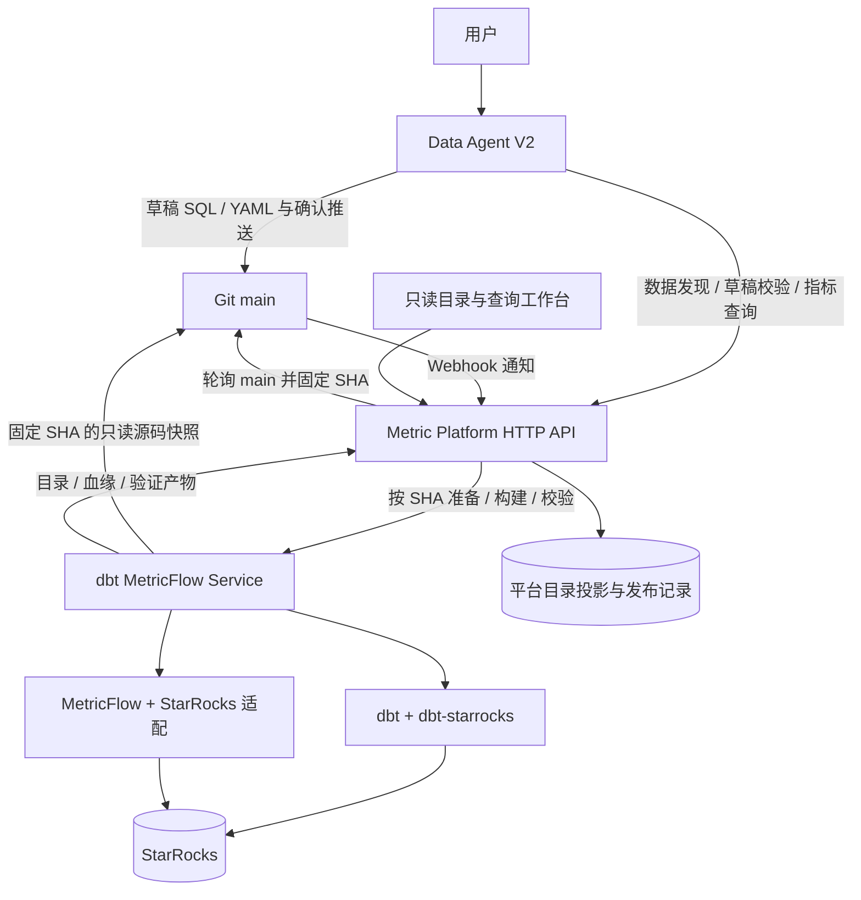

# 架构

# Agent 驱动的 dbt / MetricFlow / StarRocks 指标平台改造设计


日期：2026\-09\-22。状态：架构设计提案，供评审；尚未执行产品改造。


## 1\. 业务目标与设计结论


用户通过 Agent 创建、修改指标、维度和数据集。Agent 生成 dbt 项目的 SQL、YAML 和测试定义，经用户审阅后提交到已有 Git 服务。指标平台订阅配置版本，通过独立 dbt/MetricFlow 服务完成解析、构建、校验和查询；平台展示只读的业务目录、定义来源、发布状态和血缘。


已确认的约束：


- 业务数据库必须继续使用 StarRocks，允许使用 `dbt-starrocks`。

- Git 是业务定义的唯一事实来源；指标平台不再提供另一套可独立编辑的指标口径。

- 复用 `data-agent-v2/`、`metric-platform/`、`dbt-metricflow-service/` 和根仓库 Git 基础设施，保持独立构建和 HTTP 集成。

- 不演进旧版 `data-agent/`，不引入新的认证、租户或多集群调度体系。

    

本提案采用的首版默认值：单配置仓库、`main`、单 dbt 项目、单 StarRocks 部署；沿用 Agent 卡片确认推送。确认动作明确告知“提交后触发模型构建与发布”，后台自动验证，全部通过后生效。一次发布允许包含多个数据集和语义模型。


推荐方案：**dbt 原生定义 \+ MetricFlow 指标语义 \+ StarRocks 执行 \+ 平台版本化只读投影**。平台不重新实现 dbt 解析器，不把新语义压缩成旧平台指标表达式。


第一期的“只读”限定为业务定义：可以查询数据、查看发布状态；新增、编辑、删除指标定义必须经过 Agent/Git。部署侧仍需要配置服务地址、profile 绑定和发布策略。


## 2\. 当前工程与目标的差距


以下结论来自本地源码和当前 README；旧设计文档与当前实现不一致时，以源码为准。


|位置|已有能力|改造决策|
|---|---|---|
|`data-agent-v2/backend/agent-git`|会话草稿、文件操作、冻结候选、差异卡片、确认后推送、冲突与结果核实|保留，增加绑定不可变草稿的 dbt 校验结果|
|`data-agent-v2/backend/agent-skill`|`git-repository-maintenance` Skill，Git 工具按需激活|保留通用 Git Skill，增加 dbt 指标建模 Skill|
|`data-agent-v2/backend/agent-data-source`、`agent-workflow`|本地 `semantic/starrocks.yaml`、模型生成 SQL、直接查询 StarRocks|新指标业务接入平台 HTTP；原通用分析链路暂不改写，不作为新指标口径来源|
|`metric-platform/metric-git-sync`|Git 快照读取、固定 `semantic/model.yaml`、Ossie 解析和校验|复用 Git 访问约束；移除新链路对固定文件与 Ossie 类型的依赖|
|`metric-platform/backend/.../gitsync`|Webhook、启动扫描、轮询、检查点、原子导入|升级为持久化发布协调器，继续负责“哪个版本生效”|
|平台 `GitPublicationService`|映射旧实体并原子更新 `appliedCommit`|复用事务发布原则；新目录使用独立版本化投影|
|平台 `QueryService`、`QueryPlanner`、`SemanticSqlCompiler`|平台自行规划、编译、JDBC 执行|新指标查询改为代理 MetricFlow 服务，旧路径只供迁移期既有调用|
|平台前端|数据集、指标、维度列表和查询工作台|复用页面结构，接入新目录与查询接口，移除新目录写操作|
|Python 服务|固定版本依赖、结构化 CLI、进程隔离、超时、项目写锁|保留；增加版本项目、持久任务、产物和类型化查询结果|
|`infra/git`|main\-only bare Git、确认后 push、hook 接点|保留，无需引入 GitLab 或 PR 分支流程|


Python 服务已声明 `dbt-starrocks==1.12.2`。缺口在 MetricFlow：当前 core 的 `SqlEngine`、方言渲染器以及 CLI 的 `SupportedAdapterTypes` 均没有 StarRocks。封装层移除 422 检查也不能接通查询。


另一个实质差异：旧 `MetricEntity` 依赖单数据集、单字段及聚合属性，不能完整表达跨模型派生指标、比率和累计指标。继续填充旧表会使平台目录与 MetricFlow 的语义逐步分叉。


## 3\. 方案比较与选择


|方案|优点|代价与结论|
|---|---|---|
|A：dbt \+ MetricFlow，补齐 StarRocks 支持|定义、查询、依赖保持同一语义；符合目标|需要维护 StarRocks 方言和执行适配；推荐|
|B：dbt 管建模，旧平台编译器管指标|短期复用现有查询实现较多|dbt/MetricFlow 与平台有两套口径；仅保留为迁移期旧链路，不作为目标|
|C：把指标提前物化为 dbt 汇总模型|固定报表简单，部分查询速度好|维度组合、过滤、去重、比率容易失去原始语义；不满足通用指标查询|


方案 A 内的适配策略：优先维护可审计的 MetricFlow fork，并争取向上游贡献。原因是当前支持集合由枚举和工厂固定，尚未找到稳定的第三方引擎注册接口。仅增加服务侧插件会依赖内部 API 或运行时替换，升级成本难以控制。


这里选择的是待实施的依赖治理方案，不代表 fork 已创建或验证。第一阶段必须证明该路线可以运行完整查询。如果届时确认上游提供受支持的扩展接口，可以在保持 HTTP 契约和验收标准不变的前提下改用独立扩展。


## 4\. 目标架构与归属




### 4\.1 Agent


负责需求澄清、已有资产检索、字段与粒度确认、项目文件修改、验证错误修复、变更解释。新业务能力全部通过平台公开 HTTP API 获得，不直接导入 Python 服务或平台实现。


复用 `agent-git` 和现有卡片生命周期。在新的 `agent-metric-platform` 模块中集中放置平台客户端和业务工具；`agent-web` 承载卡片/BFF，`agent-server` 装配，持久实体仍归 `agent-persistence`。不重写 ReAct 执行器。


### 4\.2 指标平台


承担业务门面、发布编排、目录检索、只读 UI、查询审计和 HTTP 契约。平台数据库的目录是投影，不是第二个定义编辑入口。


平台是唯一的发布控制者：发现目标 SHA，记录发布任务，调用 Python 服务，检查产物，再切换 `activeReleaseId`。Python 服务只报告某个运行版本已准备好，不独立推进 main 或切换平台版本。


### 4\.3 dbt/MetricFlow 服务


负责项目快照准备、dbt 解析与构建、语义能力校验、StarRocks 查询执行和稳定产物输出。保留独立 Python 进程执行上游命令的隔离方式。


项目绑定由部署配置给出：`projectId -> repositoryId + remote + projectSubdir + profileBindingId`。API 不接受任意 Git URL、宿主机路径或 profile 文本。服务可以 fetch，但只能读取请求指定且属于配置仓库 main 历史的 commit，不能自行把请求解释为最新 main。


StarRocks 凭据由服务 profile/secret 统一持有。平台保留数据源显示信息和绑定标识，新链路的数据源结构发现也通过服务 API 完成；迁移期间旧 JDBC 凭据只供旧路径使用。


## 5\. Git 中维护哪些文件


配置仓库承载完整 dbt 项目，区别于工程源码仓库：


```Plain Text
dbt_project.yml
models/
  sources.yml
  staging/
    stg_orders.sql
    stg_orders.yml
  marts/
    fct_orders.sql
    fct_orders.yml
    dim_customers.sql
    dim_customers.yml
  metrics/
    derived_metrics.yml
  time_spine/
    time_spine.sql
    time_spine.yml
tests/
  orders_business_rules.sql
```


- SQL 定义数据转换，使用 `source()` 和 `ref()` 表达依赖。

- YAML 定义字段说明、实体、维度、指标、测试和业务展示元数据。

- 固定采用当前 dbt 1\.12 基线可验证的语法，复用 `data-agent-v2/examples/metricflow` 的模型内语义定义样例；不混用来自其他 dbt 版本的模板。

- 中文名、描述和业务说明优先使用标准字段；平台特有显示属性放在受版本约束的 `meta.metric_platform` 中。每类资源的准确字段位置需由样例 parse 测试锁定。

- 业务数据源连接只保存无凭据的逻辑名称；`profiles.yml`、密钥、`target/`、`logs/`、实际数据不进入 Git。

- 首版不允许 Agent 修改任意宏、包依赖、hooks、运行 profile 和发布 schema 规则。必要的项目初始化及 schema 命名宏由维护者提供并锁定摘要。

- 首版业务仓库不接收原始业务 CSV seeds；测试固件留在产品测试目录。

    

平台对象的语义映射：


|展示对象|权威来源|关键边界|
|---|---|---|
|数据集|dbt model|所有模型进入技术目录，显式标记的模型进入业务目录；ephemeral 不提供直接预览|
|字段|model 列定义及构建后的列元数据|未声明类型不能伪造；物理类型与业务维度角色分开|
|维度|semantic model 的维度定义|保留语义模型和实体限定名，同名列不自动合并|
|指标|MetricFlow 指标定义|保存原生类型、依赖、过滤与可查询状态，不转换成旧聚合枚举|
|关联|entities 和 MetricFlow 可用连接路径|dbt relationships 测试用于数据质量，不能直接等同于查询 JOIN 规则|
|血缘|manifest 节点依赖与语义依赖|区分物理依赖、语义引用和测试关系|


对象稳定标识由仓库、项目、资源类型及原生唯一标识生成，不包含 releaseId；版本化内容另以 releaseId 区分。重命名默认视为删除旧对象、新建对象。第一期不引入跨版本重命名追踪系统。


## 6\. StarRocks 适配怎么做


### 6\.1 复用 dbt\-starrocks


继续负责连接、元数据读取、建表/视图、模型执行和测试。其存在不等于 MetricFlow 支持该引擎。源码与版本锁定沿用当前服务方式。


### 6\.2 MetricFlow 最小改动集合


在受控 fork 中维护以下改动，并建立 StarRocks 专属测试：


1. core 增加 StarRocks 引擎类型、能力声明和 SQL renderer。

2. CLI 增加 adapter 到引擎/renderer 的映射，复用 dbt adapter 的连接与结果获取。

3. 明确标识符引用、catalog/schema/table 限定、日期截断和偏移、类型转换、整数除法、NULL、排序、JOIN 与时间骨架的行为。

4. 增加结构化输出能力，为服务输出列、类型、原始值、SQL、依赖与错误信息；查询结果与诊断日志分离。

5. 对尚未支持的指标、聚合或时间粒度返回明确能力错误，禁止退回其他数据库方言或旧平台编译器。

    

当前上游 CLI 虽然提供 CSV 输出，但没有完整类型信息，且空结果分支与 CSV 分支不同；当前封装服务只保存截断 stdout。它们不能直接作为稳定的产品查询协议。采用 fork 中公开、版本化的 JSON 输出入口，服务继续调用安装后的公开 CLI，不跨目录导入内部实现。


查询过滤由受控的字段/操作符/类型化值表达式生成。当前 `AdapterBackedSqlClient` 明确拒绝 bind parameters，因此不能宣称安装 adapter 后就保留了旧 JDBC 参数绑定能力。适配阶段必须实现并验证参数传递路径；若该路径不能覆盖首版过滤，则以有独立测试的 StarRocks 类型化字面量编码器生成过滤表达式，拒绝原始 SQL/Jinja 和未知表达式，不能用字符串替换改写整段 SQL。


### 6\.3 上游依赖与仓库规则


`dbt-metricflow-service/AGENTS.md` 禁止直接修改 `vendor/*`，设计保留这个约束。适配代码在独立维护的上游 fork 开发、验证和发布；服务只更新受控来源的 gitlink 与锁文件。当前 core 和 CLI 来自同一个上游仓库的不同发布点，需要分别固定兼容的 fork revision。


fork 对外版本应包含可辨识的适配版本信息，`/v1/versions` 返回上游基线、fork revision、适配版本及能力清单。依赖元数据、构建来源检查和精确版本测试同步更新，不能伪装成未修改的官方构建。此设计不执行 fork 创建、远端推送或版本变更。


若最终要求“只用当前官方包且不做扩展”，则当前版本无法兑现 StarRocks 上的完整 MetricFlow 查询。那将是业务目标需要重新取舍，而不是一个配置开关。


## 7\. 从草稿到发布的完整过程


### 7\.1 Agent 草稿与确认


1. 检索平台已发布目录及受控的数据源结构，澄清指标口径、数据粒度、时间归属和维度。

2. 准备 Git 草稿，读取现有 SQL/YAML 后做最小文件修改，并生成相应测试。

3. Agent 服务端生成完整的不可变候选快照，经平台提交草稿校验。跨服务通过有大小限制的文件清单传递，不传 Agent 本机目录。

4. 校验记录绑定 `baseCommit + treeId + contentDigest + toolchainVersion + policyVersion`；digest 覆盖整个项目的受支持文件，不只覆盖 diff。服务端重新计算摘要，拒绝路径穿越、符号链接和重复路径。

5. 草稿只执行允许范围的解析、语义校验和受控编译，不构建正式模型。dbt compile 可能因宏访问数据库，不能把它宣传为纯离线检查；此阶段使用受限账号并禁止非受控宏/hooks。

6. 校验通过后生成现有确认卡片，展示口径变化、文件差异及“推送后自动构建发布”的影响。`git_change_prepare` 服务端检查该内容的有效校验记录，不能只依赖 Skill 提醒。

7. 用户点击确认后沿用现有提交与推送机制。内容变化、合并或冲突处理后必须重新验证；仅基于相同内容且匹配版本的记录才能复用。

    

`PUSHED` 继续只代表 Git 成功。平台发布状态使用独立状态栏按 commit 查询，不复用或扩展成同一 Git 状态机。Agent 会话不需要一直运行；前端状态读取或用户后续询问可获得生效情况。


### 7\.2 平台订阅与发布


1. 复用 Webhook、启动扫描与轮询。Webhook 只是刷新信号，平台从受信任远端重新解析 main，记录 `desiredCommit`。

2. 持久化 release 及幂等键，固定 SHA、构建参数和工具链版本，调用服务准备项目。平台和服务分别核对 commit 与项目绑定。

3. 服务从该 SHA 导出源码，构建期间源码不变，产物写入本次运行独立目录；查询使用的已完成产物不能被后续 parse 覆盖。

4. 执行 parse、语义能力校验、build/test、物理元数据收集、代表性 MetricFlow explain 和小范围查询验证。parse 成功本身不能证明指标可执行。

5. 服务返回 READY 与完整产物摘要。平台导入候选目录、依赖图和验证结果，确认其所属 release、SHA、profile 配置版本和工具链一致。

6. 在短事务中检查本项目发布序号和 expected activeReleaseId；候选必须仍是当前可发布的目标，才原子切换 activeReleaseId。外部构建和网络调用均在事务外。

7. 新提交在旧构建期间到达时，记录新目标；旧任务可以结束，但过时的成功结果标为 SUPERSEDED，不能覆盖新目标。失败不会推进生效指针。

    

建议状态：


```Plain Text
DETECTED → PREPARING → VALIDATING → BUILDING → VERIFYING → READY → ACTIVE
                    任一步失败 → FAILED
                    目标已过时 → SUPERSEDED
```


服务 READY 后平台崩溃，可以按 releaseId 重新读取产物并完成发布；不要求 Git、StarRocks、Python 服务和平台数据库参与一个分布式事务。


### 7\.3 StarRocks 模型发布隔离


首版推荐每次构建使用独立 schema，例如由服务生成的 `analytics_r_<releaseToken>`。原始 source 位于稳定的只读来源中；模型通过 ref 只引用本次发布目标。服务生成 target schema，不接受 Agent 指定任意目标库。


新版本 build/test 失败不会覆盖当前版本的物理模型。平台发布后，查询根据 release 的实际 relation 查询新 schema；在途请求继续读取旧 schema。至少保留当前和上一成功版本，并对正在查询的版本加引用保护，清理不在请求路径执行。


代价是首版完整构建与额外存储。首版开放 table/view/ephemeral；跨发布增量状态、snapshot 和异步物化视图先不开放，待数据规模与刷新要求明确后再设计。若全量构建成本不可接受，需要改选兼容性发布或按依赖复用模型的方案，不能把共享 schema 的 build 当成原子切换。


回滚定义通过 Git revert 产生新提交并重新发布；首版不自动删除旧 schema。该设计保证模型结构和语义版本一致，不保证实时变化的原始数据、视图读取结果或多次查询拥有历史数据快照。数据刷新与定义发布是两件事；首版 table 为构建时快照、view 读取实时来源，UI 展示构建时间。定时刷新不在首版范围，后续刷新也应产生新的运行版本。


## 8\. 平台数据库、接口与页面


### 8\.1 新增最小持久模型


在平台现有 PostgreSQL 中增加以下表，使用新的 Flyway 迁移：


|表|作用与核心字段|
|---|---|
|`semantic_project`|仓库/项目/profile 绑定、desiredCommit、activeReleaseId、发布序号；保存状态，不保存可编辑的业务口径|
|`semantic_release`|releaseId、commitSha、源码摘要、工具链和配置版本、状态、服务任务标识、产物摘要、错误、时间|
|`semantic_resource`|releaseId、稳定 resourceId、原生标识、类型、名称、描述、检索字段、原生定义 JSON、文件位置、queryable/capabilities|
|`semantic_dependency`|releaseId、上下游资源标识、依赖类型|


首版资源定义保存 JSON，必要的分页/搜索字段单独索引，不提前把所有 MetricFlow 属性拆成关系表。数据集列可随模型定义 JSON 保存，维度和指标独立索引。各版本目录不可就地编辑。


现有 `git_sync_state`、归属表和旧实体继续服务旧 Ossie 模式；新 dbt 模式使用新的发布表，避免误将“源码已导入”当成“物理模型已发布”。同一业务目录不能同时启动两套发布器。


### 8\.2 平台公开接口草案


新增命名空间 `/api/v1/semantic-projects/{projectId}`，不静默改变现有同步 `/api/v1/queries` 的 200 响应协议。


|方法与相对路径|用途|
|---|---|
|`GET /catalog?releaseId=...&kind=...`|分页获取数据集、维度、指标；不传版本时解析当前生效版本|
|`GET /resources/{resourceId}?releaseId=...`|定义、来源文件、口径、物理 relation、能力说明|
|`GET /resources/{resourceId}/lineage?releaseId=...`|指定深度/数量限制的依赖子图|
|`GET /releases`、`GET /releases/{releaseId}`|发布记录、阶段、错误和当前生效状态|
|`POST /validations`、`GET /validations/{id}`|Agent 提交不可变草稿、获取诊断；不修改正式业务目录|
|`POST /queries:explain`|校验指标/维度组合并生成 SQL，返回解析后的 releaseId|
|`POST /queries`、`GET /queries/{queryId}`|异步指标查询，提交返回 202，结果绑定版本|
|`POST /datasets/{resourceId}:preview`|对已发布可预览 relation 进行有界查询；不接受任意 SQL|
|`GET /sources/...`|受控的数据源表和字段发现，供 Agent 建模使用|


查询请求包含 releaseId、指标标识、维度及时间粒度、类型化过滤、时间范围、排序和 limit。首次目录响应返回 releaseId，前端后续操作显式传递它。过期/已清理版本明确报错，禁止自动替换为新版本。


维度组合由 MetricFlow 验证，不能仅把各指标维度列表取交集就认定可查询。维度成员搜索也必须带指标上下文和版本，通过受控查询执行，限制 distinct 值数量。


查询结果至少包含 queryId、releaseId、commitSha、columns、rows、rowCount、truncated、elapsedMs。Decimal 和大整数采用精确字符串及类型元数据，时间值使用明确时区/类型的标准格式；UI 不能依赖 JS Number 保证金额精度。


平台认证沿用现有机制；Agent 使用部署侧配置的服务访问凭据。`api/openapi.yaml` 同步定义输入、202 任务流程、结果精度、错误和认证，前后端契约测试一并更新。


### 8\.3 Python 服务内部契约草案


在保留现有诊断接口的基础上增加：


- `POST /v1/project-runs`：固定项目、SHA、构建参数和幂等键，返回运行标识；不接受任意 remote/命令。

- `GET /v1/project-runs/{id}`：持久状态及诊断摘要。

- `GET /v1/project-runs/{id}/catalog`、`/lineage`、`/artifacts`：类型化目录、血缘、产物清单；文件按白名单标识读取。

- `POST /v1/draft-validations`：完整候选快照验证，与发布运行分离。

- `POST /v1/query-jobs`、`GET /v1/query-jobs/{id}`：引用 READY 运行版本的 explain/query/preview，结果独立于 stdout。

- 受控的 source introspection 和 capabilities 端点。

    

原始 `manifest.json`、`semantic_manifest.json`、`run_results.json` 由服务保存并校验；平台消费封装后的版本化 DTO。字段与类型补充来自 `catalog.json` 或受控元数据读取，不能假设 parse 已获取真实列信息。新增 docs/show 等命令只有在明确所需时才加入白名单。


首版保持单服务实例，以标准库 SQLite 在独占持久卷中保存运行状态和幂等键；产物保存在该卷的独立运行目录，终态通过原子文件写入和数据库事务登记。平台保存业务发布状态，服务保存执行状态，双方不共享数据库表。多副本任务协调暂不做。


同一幂等键、相同请求返回原任务；请求摘要不同返回 409。重启后不能凭“进程不存在”认定任务成功，也不能自动重放不确定的写操作。残留运行标记 INTERRUPTED，核实数据库任务和运行产物后，由发布重试创建独立构建代次。查询超时应同时终止子进程并落实数据库查询超时/取消。


### 8\.4 页面变化


- 数据集/指标/维度列表与详情保留布局，使用新目录 API，展示定义文件、Git SHA、发布时间和口径说明。

- 移除新目录的创建、编辑、删除、同步字段入口；后端同样拒绝定义写入，不能只隐藏按钮。

- “通过 Agent 修改”作为未来可选导航，不作为首版必要依赖。

- 查询工作台从 MetricFlow 返回的能力生成可选项，展示结果、SQL 和所用版本；新查询不经过旧编译器。

- 新增发布状态视图，区分 Git 最新提交与当前生效版本。首次发布失败时显示未发布；不展示部分候选对象。

- 首版血缘展示 source → model → semantic model → metric，以及派生指标依赖。字段级 SQL 血缘不在本次承诺中；模型级 manifest 不能冒充字段级解析结果。

    

## 9\. 执行与失败边界


dbt 项目包含 SQL、Jinja 和可能执行代码的宏，从“读取 YAML”变成“运行项目”是实质变化。首版采用固定项目模板、受控宏/依赖和文件范围；草稿解析与正式构建均在受限运行进程中执行。


构建账号仅能写受管理的发布 schema、只读业务 sources；查询账号只读；profile 及 schema 映射由服务端控制。查询进程不继承构建账号 secret，不能仅靠客户端请求的“只读”标志隔离。共享 Git hook 不执行 dbt，仅发通知。


|失败|预期行为|
|---|---|
|草稿 YAML/引用/语义错误|返回文件位置和诊断，Agent 修复；不能生成可提交的有效校验凭证|
|main 已前进|按现有冲突机制处理；合并后的新内容重新校验|
|Webhook 重复/丢失/乱序|轮询真实 main，按版本幂等收敛|
|parse 成功但 build/test 失败|发布失败，保留旧目录和旧物理发布|
|服务 READY 后平台导入失败|保留旧生效版本，按同一 READY 产物重试导入|
|旧任务晚于新目标完成|标记过时，不反向覆盖生效指针|
|查询期间发布切换|当前请求继续使用已解析的 release，后续请求按新目录版本选择|
|服务重启/网络超时|按幂等键核实，明确区分失败与结果未知，不重复执行不确定写入|
|不支持的指标类型或粒度|在发布校验时拒绝；不能隐式降级成另一种算法|
|删除或重命名资源|新 release 中不存在；旧 release 查询保持原有标识直至清理|


日志只记录任务、版本、耗时、错误码和脱敏诊断。数据结果与完整 SQL 的访问遵循现有查询权限，不能把 stdout 当成结果存储和审计日志的混合通道。


## 10\. 分阶段改造与验收


各阶段分别形成可执行计划。以下是阶段边界和完成标准，不是已经批准执行的实施计划。


### 阶段 1：验证 MetricFlow → StarRocks


范围：MetricFlow 受控适配及 Python 服务测试。先解决最大技术不确定性，再改平台主链路。


首批能力为简单聚合、精确 count\_distinct、普通过滤、日/月分组、事实表到维表的多对一关联、比率/派生指标。使用现有演示的订单、客户和时间骨架定义作为依据，在临时 StarRocks schema 中测试。


验收：真实 StarRocks 上收入、订单数、地区/日期分组、客单价结果与手写基准 SQL 相等；包含 NULL、空结果、无匹配关联、重复维表键、零分母和跨月边界。仅 SQL 快照或 DuckDB 测试通过不能视为此阶段完成。


累计、同比/环比、percentile、非可加指标等按能力清单逐步增加；尚未验证的类型在平台和 Agent 中明确不可发布。所有目标业务若要求这些能力，需纳入后续验收，不能将首批能力宣称为 MetricFlow 全量支持。


### 阶段 2：版本项目与构建产物服务


范围：`dbt-metricflow-service`。实现固定 SHA 项目准备、独立 schema、持久运行、幂等、产物 DTO 和结构化查询；复用现有任务进程控制。


验收：同 SHA/同配置请求不会重复构建；查询与构建不共享可变 target；失败构建不影响旧版查询；重启能识别未完成任务；产物与查询能追溯到准确版本。


### 阶段 3：指标平台 dbt 发布与只读查询


范围：平台后端、`metric-git-sync`、OpenAPI 和前端。


复用 Git 通知与读取约束，新增发布状态/投影，接入服务，新增目录、血缘、查询接口，改造已有页面。新老模式由项目级配置选择，同一目录不双写。


验收：手工维护一个 dbt Git 提交即可完成“订阅 → 构建 → 展示 → 查询”；失败仍能查询旧版本；重复事件和并发提交不倒退；所有新定义的写入口均被后端阻止。


### 阶段 4：Agent 生成、验证与确认闭环


范围：Agent 平台客户端模块、建模 Skill、草稿校验门禁、Git 卡片和契约。


工具按业务职责提供：数据源发现、目录搜索、资源读取、草稿校验、指标查询；复用现有 Git 文件工具。校验工具传 revision/digest 等引用，快照由服务端组装，模型不能伪造会话、仓库或 profile。


验收：用户请求“按客户地区和月份统计已支付收入”，Agent 生成可解析 SQL/YAML 和测试，验证后展示差异，点击确认后推送，平台发布并返回正确查询；改变草稿后旧验证失效。


### 阶段 5：迁移既有资产与收敛旧链路


首先导出资产清单、引用和口径，形成逐对象映射。Ossie dataset 对应物理表时，优先生成显式投影的 dbt model；简单指标转换为原生指标，无法精确映射的规则必须记录并人工核对，不能静默丢弃。


保留旧对象 ID 的迁移映射，验证已保存查询和 Agent 引用；无法兼容的旧 API 明确标记弃用并迁移调用方。针对同一数据基线比较行数、金额、过滤、去重及 JOIN 结果。


验收：业务目录全部转为 Git/dbt 管理，现有业务调用迁到新链路，查询通过 dbt/MetricFlow 服务。完成后才安排独立清理计划移除 Ossie 解析器、旧编译器与编辑入口；不在初期删除旧表或测试。


最终还需同步根仓库和产品 AGENTS/README 的职责描述：新增 Python 服务归属，修订“平台必须保持自有编译器”这一旧约束，说明 vendor 仍只读、适配通过受控依赖发布。根仓库只修改跨产品文档和部署资产，产品代码仍位于各自仓库。


## 11\. 首版范围与成本取舍


首版交付：一个完整 dbt 项目、StarRocks 上已验证的指标能力、Git 驱动发布、只读目录、模型/指标血缘、指标查询和数据集预览、Agent 确认提交。


首版暂不做：多仓库/多环境晋级、PR 平台、任意宏市场、任意 SQL 编辑器、字段级血缘、跨发布增量状态、自动数据刷新调度、多副本执行协调和新认证体系。


主要新增维护成本是 MetricFlow fork、发布 schema 的存储/构建开销，以及三方版本契约。用固定版本、真实 StarRocks 回归、明确能力清单和小批次阶段发布控制这些成本。


## 12\. 依据与评审重点


本地依据：


- `infra/git/README.md`：main\-only Git、确认推送、hook 接点。

- `data-agent-v2/docs/agent-git-runtime.md`：候选冻结、推送状态与业务校验缺口。

- `data-agent-v2/examples/metricflow/models/fct_orders.yml`：当前 dbt 1\.12 语法样例。

- `metric-platform/docs/git-sync.md`：Ossie Profile、原子导入和旧查询语义。

- `metric-platform/backend/src/main/java/com/metricplatform/gitsync/GitSyncCoordinator.java`：当前内存轮询与解析耦合。

- `metric-platform/backend/src/main/java/com/metricplatform/query/QueryService.java`：自有规划、编译和 JDBC 执行。

- `dbt-metricflow-service/AGENTS.md`、`pyproject.toml`：固定依赖与上游只读约束。

- `dbt-metricflow-service/src/dbt_metricflow_service/models.py`、`commands.py`：当前任务模型与 CLI 输出方式。

- `dbt-metricflow-service/vendor/metricflow/metricflow/protocols/sql_client.py`：引擎枚举和查询协议。

- `dbt-metricflow-service/vendor/dbt-metricflow/dbt-metricflow/dbt_metricflow/cli/dbt_connectors/adapter_backed_client.py`：adapter 工厂和参数绑定限制。

    

官方资料（用于能力边界，具体语法仍以锁定版本测试为准）：


- [StarRocks dbt 集成](https://docs.starrocks.io/docs/integrations/dbt/)

- [dbt manifest](https://docs.getdbt.com/reference/artifacts/manifest-json)

- [dbt semantic manifest](https://docs.getdbt.com/reference/artifacts/sl-manifest)

    

评审最重要的三个选择：是否接受维护受控 MetricFlow 适配版本；是否接受首版独立 schema/完整构建的成本；首批指标能力是否覆盖当前最重要的业务请求。其余模块与接口围绕这三个选择展开。

